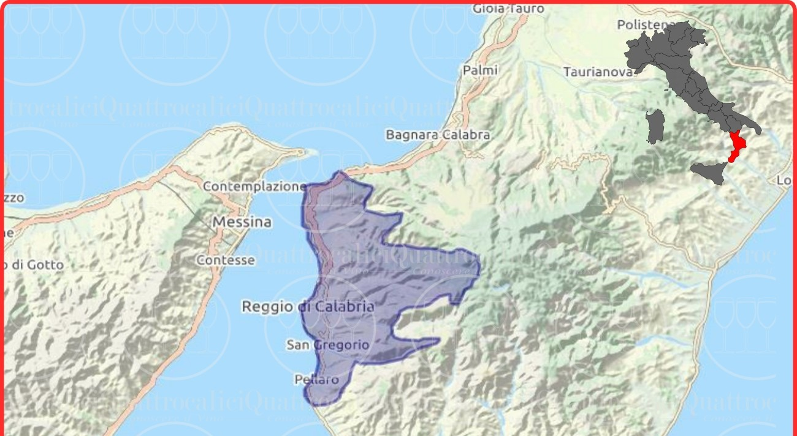
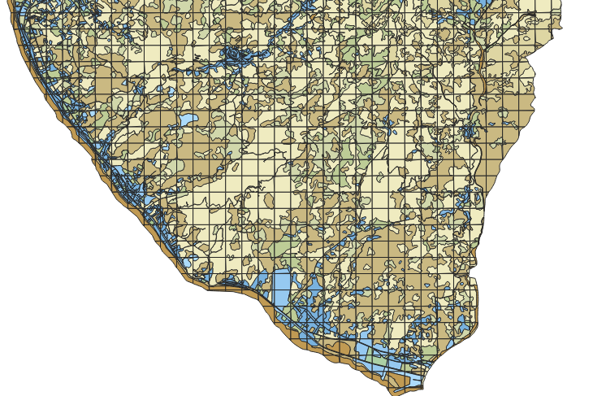

<p align="center">
  <h2 align="center">Analisi micro area del comune di Reggio-Calabria</h2>
</p>

<p align="center">  
    
</p>
<p align="center">
  <sub> La seguente immagine rappresenta la micro area della regione Calabria di cui tratteremo.  </sub>  
</p>


## 📌 Descrizione del Progetto
Questo progetto utilizza **QGIS** per analizzare una sotto-area applicativa della regione **Calabria**, suddivisa in sottopoligoni categorizzati. L'analisi si concentra sul calcolo del perimetro e dell'area totale in percentuale rispetto alla suddivisione reticolare **(400x400)** del territorio.
<p align="center">  
    
</p>
<p align="center">
  <sub>Figura 1: Immagine esplicativa della suddivisione categorizzata (wiki-Scotland) e georeferenziata </sub>
</p>

## 📖 Indice:
- [Obiettivi](#obiettivi)
- [Dati di Input](#dati-di-input)
- [Strumenti e Tecnologie Utilizzati](#strumenti-e-tecnologie-utilizzati)
- [Processo e Metodologia](#processo-e-metodologia)
- [Istruzioni per l'Uso](#istruzioni-per-luso)
- [Contatti e Riferimenti](#contatti-e-riferimenti)

---

## Obiettivi:
Il progetto si propone di:  
✔️ Calcolare l'area di ogni sottopoligono appartenente al reticolo.  
✔️ Definire la percentuale di area occupata rispetto alla griglia e al poligono.  
✔️ Aggregare le aree per categoria utilizzando il campo `code_2018`.  

---

## 📊 Dati di Input:
- **Un GeoPackage** (`IT025L3_REGGIO_DI_CALABRIA_UA2018_v013 — IT025L3_REGGIO_DI_CALABRIA_UA2018.gpkg`)

## 📂Dati di Output:
- **Poligoni della Calabria** (`Calabria.shp`)
- **Reticolo di riferimento** (`ReticoloClip.shp`)
- **Tabella dati esterna** (`CalabriaAree.csv`)

---

## 🛠 Strumenti e Tecnologie Utilizzati
- **QGIS 3.x** → Per l'analisi spaziale e gestione layer.
- **SQL** → Per operazioni geospaziali.
- **PyQGIS** → Automazione dei processi di analisi.

---

## 🧩 Processo e Metodologia  

### 1️⃣ **Categorizzazione dei Dati**
I dati sono stati suddivisi utilizzando l'attributo `code_2018`, che identifica 25 tipi di suolo.

<p align="center" > </p>
<p align="center">
  <sub> Figura 2: La seguente schermata rappresenta la categorizzazione del suolo tramite il tool di stile in alto a sinistra.  </sub> </p>

### 2️⃣ **Etichettatura dei Poligoni**
I poligoni sono stati etichettati per facilitare l'aggregazione delle aree.

<p align="center" > </p>
<p align="center">
  <sub> Figura 3: Nella seguente immagine viene mostrato il poligono di interesse etichettato in base alle aree di cui è composto.  </sub> </p>


### 3️⃣ **Creazione del Reticolo**
Un reticolo **400x400** è stato generato con lo strumento: **crea reticolo** e tagliato sulla sagoma del poligono d'interesse.

<p align="center"></p>
<p align="center">
  <sub> Figura 4 Immagine del reticolo ritagliato sulla base del poligono di interesse.  </sub> </p>

E' in fine stato applicato un tool di intersezione per unificare i due layer ed ottenere una mappa come in figura 1.  

### 4️⃣ **Calcolo delle Aree**
Inizialmente è stato necessario identificare i singoli riquadri del reticolo; questo è stato possibile tramite la funzione:
```markdown
id_grid=$row
```
Utilizzando il **Calcolatore di Campi** in QGIS, è stata calcolata l' **area** e il **perimetro** per ogni poligono:

```markdown
SingleArea = $area    # Area del singolo poligono
SinglePerim = $perimeter # Perimetro del singolo poligono
```

Successivamente, è stata calcolata la percentuale dell'area e del perimetro rispetto al poligono di riferimento di un singolo elemento:

```markdown
AreaP = (SingleArea / area) * 100
PerimP = (SinglePerim / perimeter) * 100
```

Infine, è stato calcolato in percentuale l'area occupata all'interno di una griglia di **160.000 m²** di un singolo elemento selezionato:

```markdown
AreaQ = (SingleArea / 160000) * 100
PerimQ = (SinglePerim / 160000) * 100
```

📌 **Nota**: Il valore **160.000** deriva dal reticolo **400x400** (in un qualisiasi caso generico basta applicare $geometry per ottenere questo valore).

<p align="center">  </p>
<p align="center"><sub> Figura 5: La seguente tabella rappresenta i dati appena citati.</sub></p>

### 5️⃣ **Aggregazione per Categoria** 

⚙️ Per calcolare l'area ed il perimetro **complessivo** di tutti i poligoni con lo stesso target si sono evidenziate due strade: 

Aggregare le aree utilizzando la funzione `aggregate()` di QGIS:

```sql
aggregate(
  layer := 'Calabria',
  aggregate := 'sum',
  expression := "area",
  filter := "code_2018" = $currentfeature["code_2018"]
)
```
<p align="center"><sub> $currentfeature viene utilizzato per evitare ambiguità tra gli stessi dati. </sub>  </p>

  
Oppure tramite lo **strumento di aggregazione** di QGIS.

📌 **Risultato**: Abbiamo ottenuto la somma di perimetri e aree per le **25 categorie** di terreni presenti nel dataset.

<p align="center">  </p>
<p align="center">
  <sub>Figura 6: Tabella aggiornata con l'aggregazione dei dati secondo il code_2018, segue:
  <ul>
    <li>La somma del perimetro totale espresso in m.</li>
    <li>La somma dell'area totale espresso in m².</li>
    <li>Il conteggio totale della popolazione categorizzato per territorio;</li>
  </ul>
  </sub>
</p>

<sub> Dalla seguente tabella possiamo già capire quale tra i tipi di suoli rilevati è presente in maggiore quantità; come ad esempio il dato con: code_2018=12220 e identifier=5138-IT025L3 che ha un'area di circa 26519385724,52m²</sub>


### 6️⃣ **Join Tabellare**
A seguito della creazione del Layer di aggregazione, si è effettuata una join tabellare con il layer (`Calabria.shp`) per ottenere:  
✔️ Perimetro e area totale per categoria.  
✔️ Informazioni demografiche (`pop_2018`).  
✔️ Possibilità di calcolare l'area relativa a una categoria specifica e quanto di questa ne rappresenta il totale:  

```markdown
AreaTOTpoligono = (AreaP / AreaTOT) * 100
```
<sub>  Percentuale dell'area occupata del poligono rispetto all'area totale  </sub>  

```markdown
AreaTOTquadrato = (AreaQ / AreaTOT) * 100
```
<sub>  Percentuale dell'area occupata nella griglia rispetto all'area totale  </sub>  

<sub>  E' stato applicato lo stesso criterio per il perimetro  </sub>  

<p align="center">  </p>
<p align="center"><sub> Figura 5: Nella seguente immagine possiamo vedere quasi per intero i dati calcolati con anesse aggregazioni e percentuali.</sub></p>  


_**Ora è possibile selezionare una porzione di territorio e calcolare la percentuale occupata sul: poligono e il totale della sua tipologia.**_  

<sub>Un possibile esempio:</sub>  
<p align="center"><sub> Nelle seguenti immagini possiamo vedere come il campo AreaQ esprima in percentuale quanto di questo poligono è presente nel quadrato.</sub></p>  
<p align="center">  </p>
<p align="center"><sub> Figura 9: Esempio di comprensione dei dati.</sub></p>    

---

## 📌 Istruzioni per l'Uso

1️⃣ **Aprire** il progetto in QGIS.  
2️⃣ **Caricare** i file `Calabria.shp`, `ReticoloClip.shp` e `CalabriaAree.csv`.  
3️⃣ **Utilizzare** il **Calcolatore di Campi** per visualizzare la tabella attributi.  

---

## 📑🖼️ ULTERIORI IMMAGINI esplicative

Le seguenti immagini dovrebbero aiutare la comprensione dei dati:

<p align="center">  </p>
<p align="center"><sub> Figura 10: Nella seguente immagine viene evidenziato quanto di quel riquadrato (grid), composto da 4 elementi, è ricopero dal dato 21000 .</sub></p>  


<p align="center">  </p>
<p align="center"><sub> Figura 11: Nella seguente immagine notiamo che il poligono è interamente nel riquadro e quindi l'area e il perimetro risultano al massimo.</sub></p>  

<p align="center">  </p>
<p align="center"><sub> Figura 12: Esempio di comprensione dei dati riguardanti un singolo poligono.</sub></p>  

<p align="center">  </p>
<p align="center"><sub> Figura 13: Rappresentazione dei campi di interesse in formato tabellare.</sub></p>  

<p align="center">  </p>
<p align="center"><sub> Figura 14: Nella seguente immagine vengono selezionati elementi interni di 16 riquadrati e possiamo vedere come provengano da questa analisi 162 istanze.</sub></p>  

<p align="center">  </p>
<p align="center"><sub> Figura 15: Segue una rappresentazione dei dati in cui vengono evidenziate area, perimetro e la popolazione, dove 12 (dato di pop_2018) si riferisce al singolo poligono mentre 483 a tutti i poligoni di quel tipo(12300) sulla classe pop_2018 .</sub></p>  

---

## 📩 Contatti e Riferimenti

- **Autore**: Grazia Di Pietro.
- **Email**: g.dipietro4@studenti.unisa.it .

---

